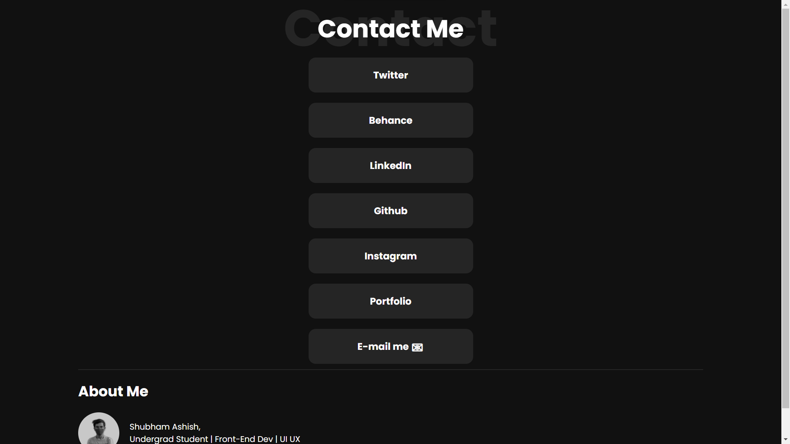

# Social Media

All social media link in one place \
[Link🚀](https://shubhamashish33.github.io/socialmedia/)

# Screenshot


# Code

HTML CODE

```html
<!DOCTYPE html>
<html lang="en">
  <head>
    <meta charset="UTF-8" />
    <meta http-equiv="X-UA-Compatible" content="IE=edge" />
    <meta name="viewport" content="width=device-width, initial-scale=1.0" />
    <title>Portfolio</title>
    <link rel="stylesheet" href="stylesheet.css">
  </head>
  <style>
    a:link, a:visited{
      color: white;
    }
  </style>
  <body>
      
      <h1>
          Shubham Ashish
      </h1>
      <h3>
          Engineering Student | Graphics Designer | UI UX |
      </h3>
      <div class="Twitter">
        <a href="https://twitter.com/imaashish_" target="_blank" rel="noopener noreferrer"><h3>Twitter</h3></a>
      </div>
      <div class="Behance">
        <a href="https://www.behance.net/shubhamashish1" target="_blank" rel="noopener noreferrer"><h3>Behance</h3></a>
      </div>
      <div class="LinkedIn">
        <a href="https://www.linkedin.com/in/shubham-ashish-81a6a01b2/" target="_blank" rel="noopener noreferrer"><h3>LinkedIn</h3></a>
      </div>
      <div class="Instagram">
        <a href="https://www.instagram.com/hiaashish/" target="_blank" rel="noopener noreferrer"><h3>Instagram</h3></a>
      </div>
          <div class="Portfolio">
        <a href="https://shubhamashish33.github.io/aboutmev2/" target="_blank" rel="noopener noreferrer"><h3>Portfolio</h3></a>
      </div>
      <div class="email">
        <a href="mailto:shubhamashish8@gmail.com" target="_blank">
          <center>
          <h3>
              Contact me &#128231
          </h3>
      </center>
      </a>
      </div>
      <footer>
        <h5>
          Made by Shubham Ashish &#128525;
        </h5>
      </footer>
  </body>
</html>
```

CSS CODE

```css
@import url("https://fonts.googleapis.com/css2?family=Rubik&display=swap");
h1,
h3,
h5 {
  font-family: "Rubik", sans-serif;
  text-align: center;
}
img {
  display: block;
  margin-left: auto;
  margin-right: auto;
  border-radius: 50%;
}
.Twitter {
  color: #01ff95;
  margin-left: auto;
  margin-right: auto;
  background-image: linear-gradient(62deg, #fbab7e, #f7ce68);
  width: 20rem;
  padding: 10px;
  margin: auto;
}
.Behance {
  background-image: linear-gradient(62deg, #fbab7e, #f7ce68);
  width: 20rem;
  padding: 10px;
  margin: auto;
  margin-top: 20px;
}
.LinkedIn {
  background-image: linear-gradient(62deg, #fbab7e, #f7ce68);
  width: 20rem;
  padding: 10px;
  margin: auto;
  margin-top: 20px;
}
.Instagram {
  background-image: linear-gradient(62deg, #fbab7e, #f7ce68);
  width: 20rem;
  padding: 10px;
  margin: auto;
  margin-top: 20px;
}
.Portfolio {
  background-image: linear-gradient(62deg, #fbab7e, #f7ce68);
  width: 20rem;
  padding: 10px;
  margin: auto;
  margin-top: 20px;
}
.email {
  background-image: linear-gradient(62deg, #fbab7e, #f7ce68);
  width: 20rem;
  padding: 10px;
  margin: auto;
  margin-top: 20px;
}
.github {
  background-image: linear-gradient(62deg, #fbab7e, #f7ce68);
  width: 20rem;
  padding: 10px;
  margin: auto;
  margin-top: 20px;
}
```
# Follow me


If you likes this repository don't forget to mark it as star 🌟. \
<br>
[](https://twitter.com/imaashish_)
